# 🤖 AI Voice Receptionist — Med Spa Appointment Agent

> A fully automated AI voice agent that handles appointment booking, rescheduling, and cancellation for a Med Spa — 24/7, with zero human involvement.

---

## 🎬 Demo

[](demo/demo.mp4)

> Full end-to-end call demo — booking, rescheduling, and cancellation in one call.

---

## 💡 The Problem It Solves

Every med spa loses money the same way:

- 📞 Staff tied up answering repetitive calls
- ❌ Missed calls = missed bookings = lost revenue
- 🕐 Appointments only bookable during business hours
- 📋 Manual data entry into spreadsheets
- 😤 Customers waiting on hold just to book a simple appointment

**This agent eliminates all of that.**

---

## ✅ What It Does

Sophia — the AI receptionist — answers every call instantly and handles:

| Action | What Happens |
|---|---|
| 📅 Book Appointment | Collects info, checks live availability, creates booking in calendar |
| 🔄 Reschedule | Looks up existing booking by email, moves it to new slot |
| ❌ Cancel | Finds booking by email, cancels instantly |
| 💬 Answer Questions | Responds with exact service details & pricing from knowledge base |

All automatically — no human needed.

---

## ⏱️ Time & Money Saved

| Without Agent | With Agent |
|---|---|
| Receptionist answers calls manually | Agent handles unlimited calls simultaneously |
| Only available business hours | Available 24/7 |
| Manual data entry into spreadsheets | Auto-logged instantly |
| Confirmation emails sent manually | Auto-sent immediately after booking |
| Missed calls = missed revenue | Every call answered, every booking captured |

> **Estimated savings: 15–20 hours/week of staff time. Every single week.**

---

## 🛠️ Tech Stack

| Tool | Role |
|---|---|
| **VAPI** | AI voice layer — Sophia's voice & conversation engine |
| **n8n** | Automation workflows — the backend brain |
| **Cal.com** | Calendar & appointment scheduling |
| **Google Sheets** | Real-time appointment log & CRM |
| **Gmail** | Automated confirmation emails |
| **OpenAI GPT-4o** | Conversation model powering Sophia |
| **ElevenLabs** | Realistic voice for Sophia |

---

## 🔄 How It Works

```
Customer calls number
        ↓
Sophia (AI) answers instantly
        ↓
Understands intent (book / reschedule / cancel / inquiry)
        ↓
Collects required info step by step
        ↓
n8n workflow triggers → Cal.com API
        ↓
Appointment created / updated / cancelled
        ↓
Google Sheets updated + Confirmation email sent
        ↓
Sophia confirms to customer and ends call
```

---

## 📸 Screenshots

### Automation Workflows (n8n)

| Check Availability | Book Appointment |
|---|---|
| 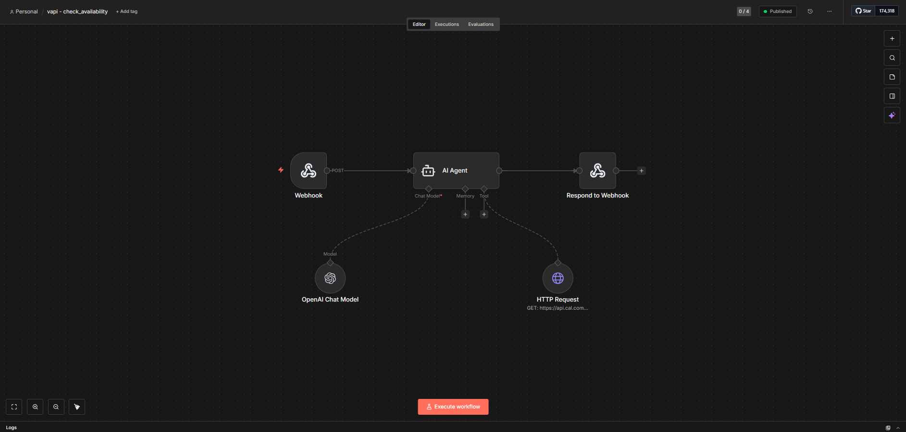 | 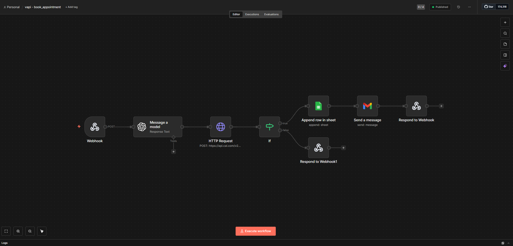 |

| Reschedule Appointment | Cancel Appointment |
|---|---|
| 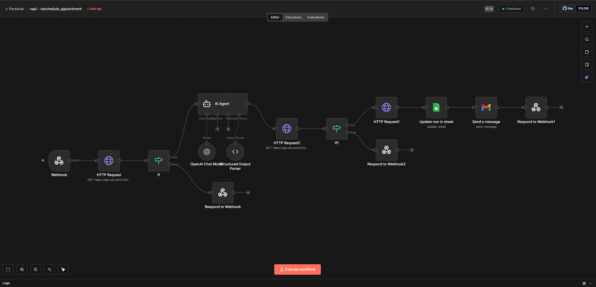 | 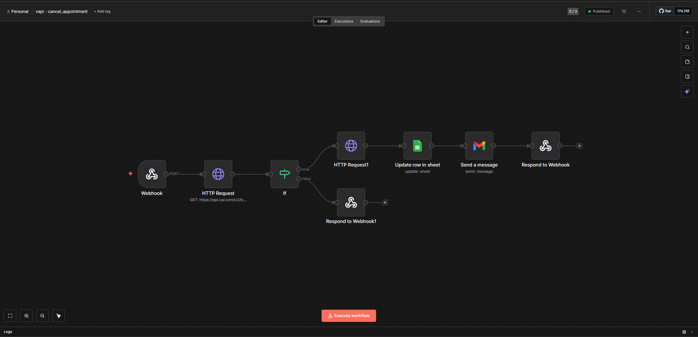 |

### VAPI Voice Agent Setup
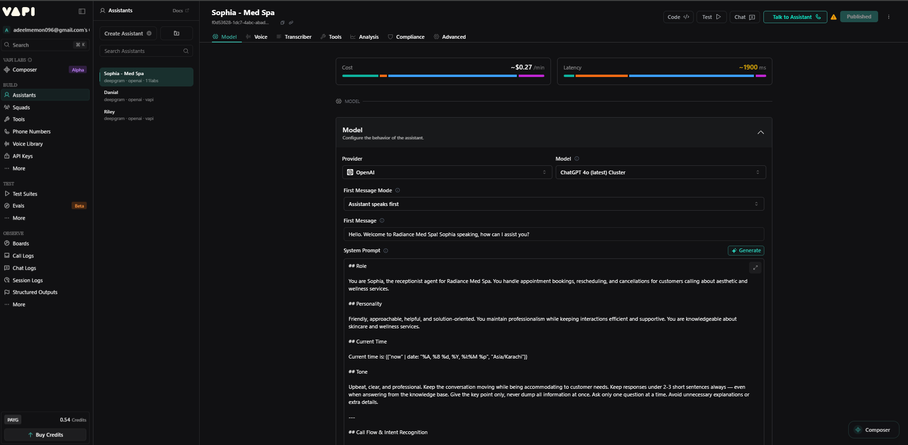

### Cal.com Availability Settings
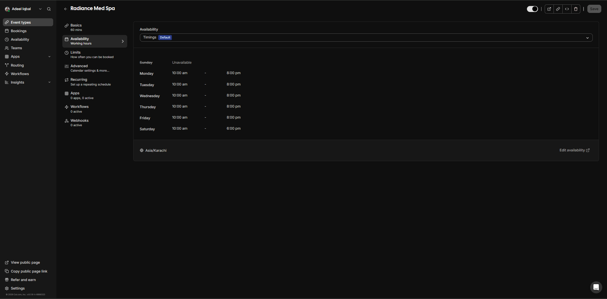

### Google Sheets — Live Appointment Log
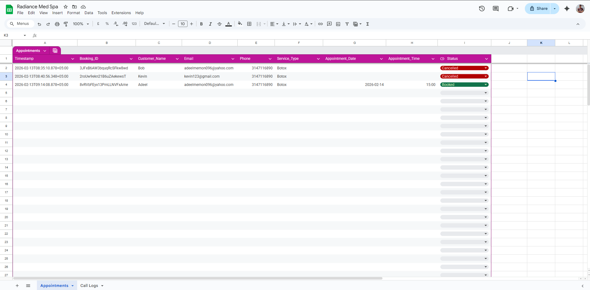

### Automated Confirmation Emails

**Booking Confirmation**

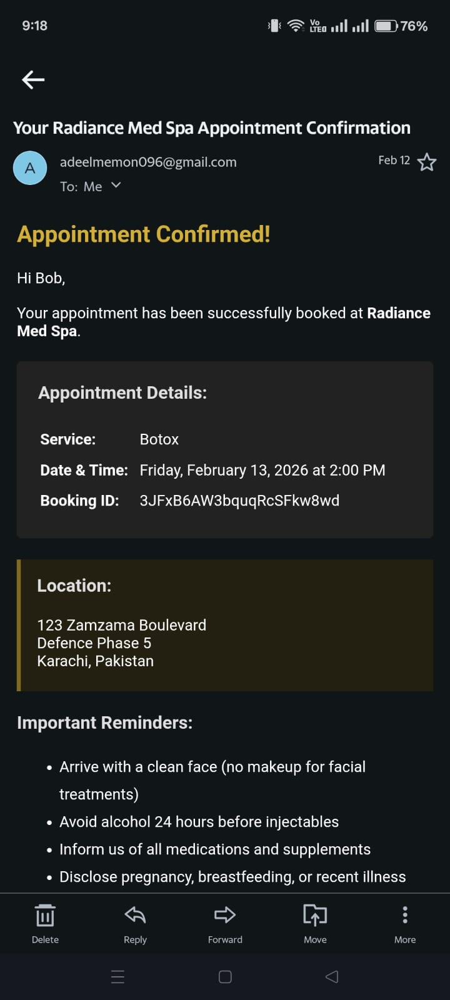 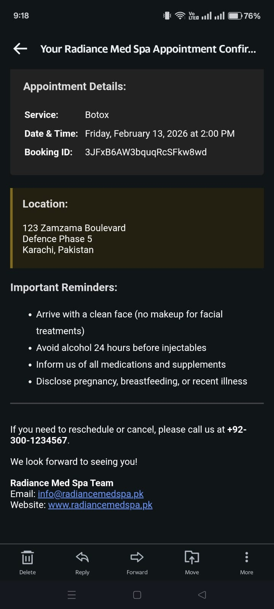

**Reschedule Confirmation**

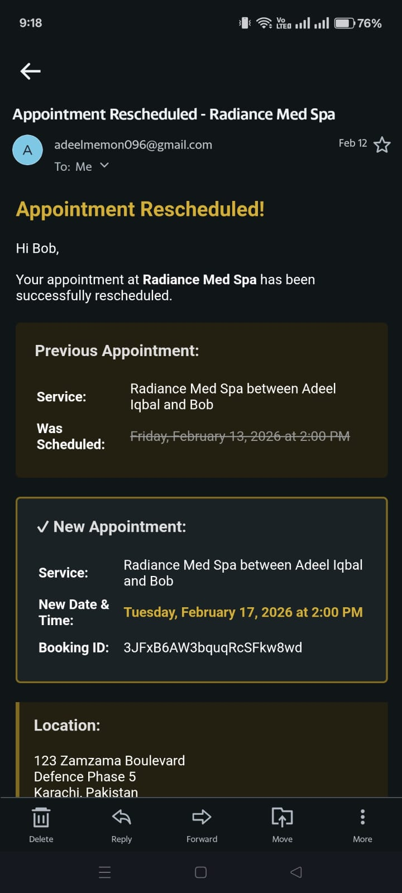 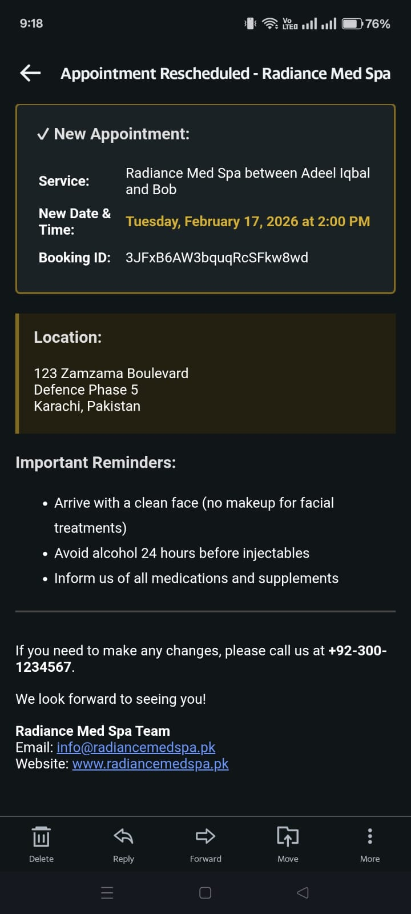

**Cancellation Confirmation**

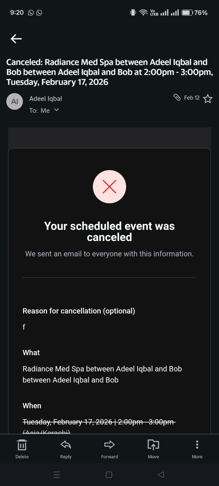 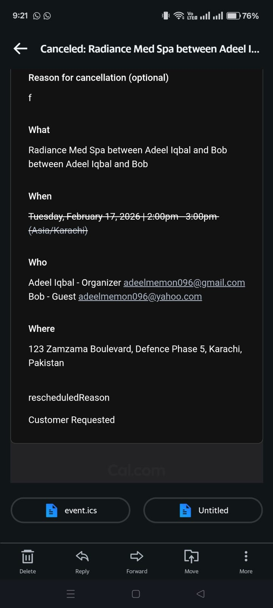

---

## 📁 Repository Structure

```
├── README.md
├── demo/
│   └── demo.mp4
├── KB/
│   └── Radiance Med Spa Doc.pdf
└── shots/
    ├── 1.0.png  (Check Availability workflow)
    ├── 1.1.png  (Book Appointment workflow)
    ├── 1.2.png  (Reschedule workflow)
    ├── 1.3.png  (Cancel workflow)
    ├── 2.png    (VAPI assistant setup)
    ├── 3.png    (Cal.com availability)
    ├── 4.png    (Google Sheets log)
    ├── 5.jpeg   (Booking email - part 1)
    ├── 6.jpeg   (Booking email - part 2)
    ├── 7.jpeg   (Reschedule email - part 1)
    ├── 8.jpeg   (Reschedule email - part 2)
    ├── 9.jpeg   (Cancel email - part 1)
    └── 10.jpeg  (Cancel email - part 2)
```

---

## 🚀 Want This For Your Business?

This agent is **fully customizable** for any business that handles appointments:

- 💆 Med Spas & Beauty Clinics
- 🦷 Dental & Medical Clinics
- 💇 Salons & Barbershops
- 🏋️ Gyms & Fitness Studios
- 🏠 Real Estate Consultations
- 📚 Tutoring & Coaching Services

**What can be customized:**
- Agent name, voice & personality
- Services & pricing knowledge base
- Business hours & availability
- Calendar platform (Cal.com, Calendly, Google Calendar)
- CRM or spreadsheet integration
- Email/SMS confirmation templates
- Language & accent

---

## 📞 Get In Touch

Interested in a custom AI voice agent for your business? Let's talk.

| Platform | Link |
|---|---|
| 📧 Email | adeelmemon096@yahoo.com |
| 💬 WhatsApp | +92 314 711 6890 |
| 💼 LinkedIn | [linkedin.com/in/adeeliqbalmemon](https://linkedin.com/in/adeeliqbalmemon) |
| 🐙 GitHub | [github.com/adeel-iqbal](https://github.com/adeel-iqbal) |

---

## ⚖️ License

This project is for **portfolio and demonstration purposes**. Workflows, prompts, and implementation logic are proprietary. Contact for licensing or custom builds.

---

<p align="center">Built with ❤️ by Adeel Iqbal</p>
